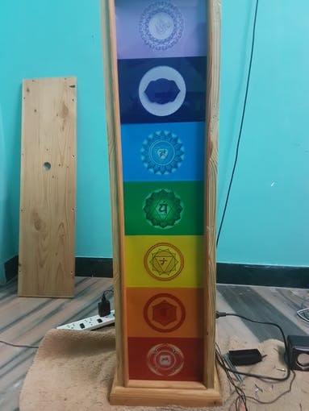
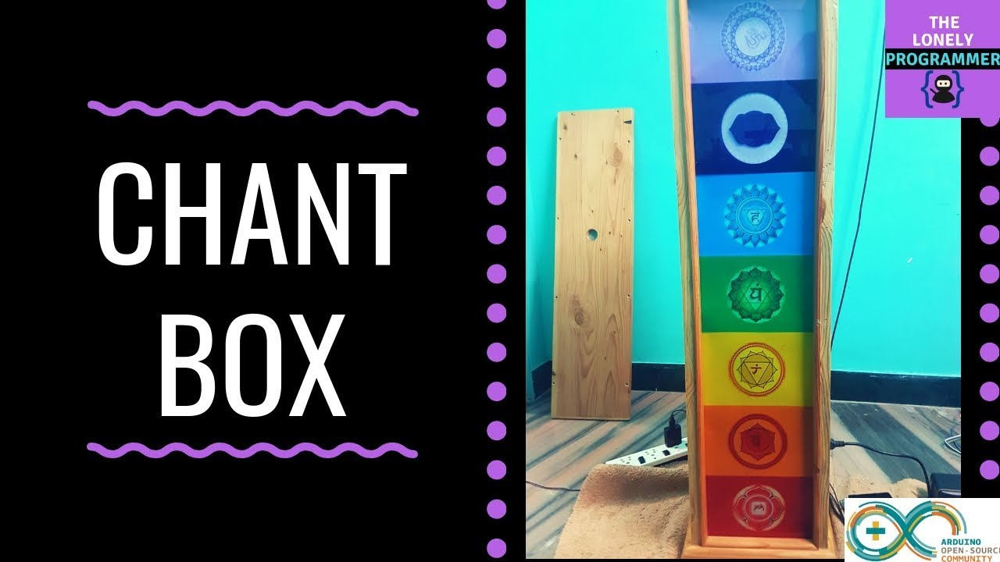

# Chakra-Healing-Harmonizer-Using-Arduino

A step to combine the technology and spiritualism. This project demonstrates the use of electronics and embedded system with Chakra Meditation. This is my step to put forth to help a yoga institution and to create an awareness about Chakra healing.

## Requirements

### Hardware

* Arduino Uno x 1
* Arduino MP3 Shield x 1
* Speaker: 3W, 4 ohms x 2
* RGB LED panel x 7
* Relay breakout board x 7

### Software

*   Arduino IDE

## Interfacing with Arduino - Chakra Healing Harmonizer

### Hardware Work

I had cut the Plywood to the required dimension and Glass to cover each RGB LED Panel.

The 12V adapter is installed for powering the device and a separate adapter is used to light the LED Panel. The Relay Connections are used to switch the LED Color Panels. Make sure that the supply is isolated.

Drill the plywood to mount the PCB.

### Connections

* **BLUETOOTH MODULE**

| Arduino           |  Blutooth Module |
|-----------------------|---------------|
| Vcc |  +3.3V|
| TX |  RX |
| RX |  TX |
| GND |  GND |

* **RELAY MODULE**

| Arduino           |  Relay Module |
|-----------------------|---------------|
| Vcc |  +3.3V|
| IN1 |  A1 |
| IN2 |  A2 |
| IN3 |  A3 |
| IN4 |  A4 |
| IN5 |  A5 |
| IN6 |  A6 |
| IN7 |  A7 |
| GND |  GND |

* **MP3 MODULE**

| Arduino           |  MP3 Module |
|-----------------------|---------------|
| Vcc |  +3.3V|
| TX |  D10 |
| RX |  D11 |
| GND |  GND |

The Overall connection is shown below.

## The Code
You can find the sample code below on the repo.

## Application
For now we will use the ready-made application. In the following days I will publish the application once after the certificates are processed.

*APP Screenshot:*

## Working of the Project 🔭

https://www.youtube.com/watch?v=fa5KX7VIZOs
 

*If you faced any issues in building this project, feel free to ask me. Please do suggest new projects that you want me to do next.*

*Share this video if you like.*

*Happy to have you subscribed: https://www.youtube.com/c/rahulkhanna24june?sub_confirmation=1*

**Thanks for reading!**
