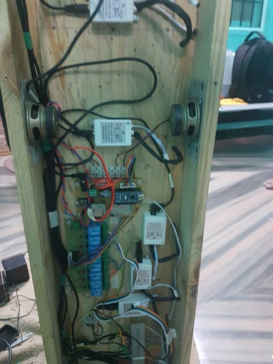

# Chakra-Healing-Harmonizer-Using-Arduino

A step to combine the technology and spiritualism. This project demonstrates the use of electronics and embedded system with Chakra Meditation. This is my step to put forth to help a yoga institution and to create an awareness about Chakra healing.

## Requirements

### Hardware

* Arduino Uno x 1
* Arduino MP3 Shield x 1
* Speaker: 3W, 4 ohms x 2
* RGB LED panel x 7
* Relay breakout board x 7

### Software

*   Arduino IDE

## Interfacing with Arduino - Chakra Healing Harmonizer

### Hardware Work

I had cut the Plywood to the required dimension and Glass to cover each RGB LED Panel.

The 12V adapter is installed for powering the device and a separate adapter is used to light the LED Panel. The Relay Connections are used to switch the LED Color Panels. Make sure that the supply is isolated.

Drill the plywood to mount the PCB.



### Connections

* **BLUETOOTH MODULE**


| Arduino           |  Blutooth Module |
|-----------------------|---------------|
| Vcc |  +3.3V|
| TX |  RX |
| RX |  TX |
| GND |  GND |

* **RELAY MODULE**


| Arduino           |  Relay Module |
|-----------------------|---------------|
| Vcc |  +3.3V|
| IN1 |  A1 |
| IN2 |  A2 |
| IN3 |  A3 |
| IN4 |  A4 |
| IN5 |  A5 |
| IN6 |  A6 |
| IN7 |  A7 |
| GND |  GND |

* **MP3 MODULE**


| Arduino           |  MP3 Module |
|-----------------------|---------------|
| Vcc |  +3.3V|
| TX |  D10 |
| RX |  D11 |
| GND |  GND |


The Overall connection is shown below.


## The Code
You can find the sample code below.
```
//Chakra Healing Harmonizer using Arduino

/*

Visit the Channel for more interesting projects

https://www.youtube.com/channel/UCks-9JSnVb22dlqtMgPjrlg

*/
#include "SoftwareSerial.h"
#include <DFPlayer_Mini_Mp3.h>

SoftwareSerial mySerial(11, 10);
# define Start_Byte 0x7E
# define Version_Byte 0xFF
# define Command_Length 0x06
# define End_Byte 0xEF
# define Acknowledge 0x00  info]

# define ACTIVATED LOW
boolean isPlaying = false;

int but = 12;
int r1= A1, r2 = A2, r3 = A3, r4 = A4, r5 = A5, r6 = A6, r7 = A7;

void setup () {
pinMode(but, INPUT_PULLUP);
digitalWrite(but,HIGH);

pinMode(r1, OUTPUT);
digitalWrite(r1,LOW);
pinMode(r2, OUTPUT);
digitalWrite(r2,LOW);
pinMode(r3, OUTPUT);
digitalWrite(r3,LOW);
pinMode(r4, OUTPUT);
digitalWrite(r4,LOW);
pinMode(r5, OUTPUT);
digitalWrite(r5,LOW);
pinMode(r6, OUTPUT);
digitalWrite(r6,LOW);
pinMode(r7, OUTPUT);
digitalWrite(r7,LOW);

Serial.begin(9600);
mySerial.begin (9600);
mp3_set_serial (mySerial); 
mp3_set_volume (25);
}

void loop () { 
 check_bt();
  }

void check_bt()
{
  while (Serial.available()){  
  delay(10); 
  char c = Serial.read();
  if ((c == '~')|| (c == '+')) {break;}
  voice += c;
  }  
  if (voice.length() > 0) {
  Serial.println(voice); 
  
  
   if(voice == "playc1") 
   {
    voice=""; p1 = 1;relay_1();
    mp3_play (1);
    wait(hr1,minute1,0);
    mp3_stop ();
   } 
   else p1 = 0;
 
   if(voice == "playc2") 
   {
    voice=""; p2 = 1;relay_2();
    mp3_play (2);
    wait(hr2,minute2,0);
    mp3_stop ();
   } 
    else p2 = 0;
    
   if(voice == "playc3")   
   {
    voice=""; p3 = 1;relay_3();
    mp3_play (3);
    wait(hr3,minute3,0);
    mp3_stop ();
   } 
    else p3 = 0;
    
   if(voice == "playc4") 
  {
    voice=""; p4 = 1;relay_4();
    mp3_play (4);
    wait(hr4,minute4,0);
    mp3_stop ();
   }
    else p4 = 0;
    
   if(voice == "playc5") 
  {
    voice=""; p5 = 1;relay_5();
    mp3_play (5);
    wait(hr5,minute5,0);
    mp3_stop ();
   }
    else p5 = 0;
    
   if(voice == "playc6") 
  {
    voice=""; p6 = 1;relay_6();
    mp3_play (6);
    wait(hr6,minute6,0);
    mp3_stop ();
   }
    else p6 = 0;
    
   if(voice == "playc7")
  {
    voice=""; p7 = 1;relay_7();
    mp3_play (7);
    wait(hr7,minute7,0);
    mp3_stop ();
  }
    else p7 = 0;
    
//////////////////////////////////////////////////////////////////////

   if(voice == "playal") 
   {
    voice=""; p_cur = 1;
    if(p1 == 1)
      {
       p1 = 0; relay_1();
       mp3_play (1);
       wait(2,0,0);
       mp3_stop ();
      }
    else if(p2 == 1)
      {
       p2 = 0; relay_2();
       mp3_play (2);
       wait(2,0,0);
       mp3_stop ();
      }
    else if(p3 == 1)
      {
       p3 = 0; relay_3();
       mp3_play (3);
       wait(2,0,0);
       mp3_stop ();
      }
    else if(p4 == 1)
      {
       p4 = 0; relay_4();
       mp3_play (4);
       wait(2,0,0);
       mp3_stop ();
      }
    else if(p5 == 1)
      {
       p5 = 0; relay_5();
       mp3_play (5);
       wait(2,0,0);
       mp3_stop ();
      }
    else if(p6 == 1)
      {
       p6 = 0; relay_6();
       mp3_play (6);
       wait(2,0,0);
       mp3_stop ();
      }
    else if(p7 == 1)
      {
       p7 = 0; relay_7();
       mp3_play (7);
       wait(2,0,0);
       mp3_stop ();
      }
                    
   } 
    else p_cur = 0;
    
/////////////////////////////////////////////////////////////////////////////    
   if(voice == "playrc") 
   {
    voice=""; p_order = 1;
    p1 = 1; relay_1();
    mp3_play (1);
    wait(hr1,minute1,0);
    p1 = 0;
    mp3_stop ();
    wait(0,1,0);
    
    p2 = 1; relay_2();
    mp3_play (2);
    wait(hr2,minute2,0);
    p2 = 0;
    mp3_stop ();
    wait(0,1,0);
    
    p3 = 1; relay_3();
    mp3_play (3);
    wait(hr3,minute3,0);
    p3 = 0;
    mp3_stop ();
    wait(0,1,0);
    
    p4 = 1; relay_4();
    mp3_play (4);
    wait(hr4,minute4,0);
    p4 = 0;
    mp3_stop ();
    wait(0,1,0);
    
    p5 = 1; relay_5();
    mp3_play (5);
    wait(hr5,minute5,0);
    p5 = 0;
    mp3_stop ();
    wait(0,1,0);
    
    p6 = 1; relay_6();
    mp3_play (6);
    wait(hr6,minute6,0);
    p6 = 0;
    mp3_stop ();
    wait(0,1,0);
    
    p7 = 1; relay_7();
    mp3_play (7);
    wait(hr7,minute7,0);
    p7 = 0;
    mp3_stop ();
   } 
    else p_order = 0;
                                          
   if(voice == "playst") {mp3_stop (); relay_stop();
   p1 = 0; p2 = 0; p3 = 0; p4 = 0; p5 = 0; p6 = 0; p7 = 0;
   p_cur = 0; p_order = 0;} 
  voice="";}
}


void wait(int h,int m,int s)
{
  int t = (h*60*60)+(m*60)+s;
  for(int i=1;i<t;i++) //1sec 1000ms
  {
    for(int j=0;j<40;j++)
    {
  delay(25);
  check_bt();
    }
  }
}


void relay_1()
{  
    digitalWrite(r1,HIGH);
    digitalWrite(r2,LOW);
    digitalWrite(r3,LOW);
    digitalWrite(r4,LOW);
    digitalWrite(r5,LOW);
    digitalWrite(r6,LOW);
    digitalWrite(r7,LOW);
}

void relay_2()
{
    digitalWrite(r1,LOW);
    digitalWrite(r2,HIGH);
    digitalWrite(r3,LOW);
    digitalWrite(r4,LOW);
    digitalWrite(r5,LOW);
    digitalWrite(r6,LOW);
    digitalWrite(r7,LOW);
}

void relay_3()
{
   digitalWrite(r1,LOW);
    digitalWrite(r2,LOW);
    digitalWrite(r3,HIGH);
    digitalWrite(r4,LOW);
    digitalWrite(r5,LOW);
    digitalWrite(r6,LOW);
    digitalWrite(r7,LOW);
}
void relay_4()
{
   digitalWrite(r1,LOW);
    digitalWrite(r2,LOW);
    digitalWrite(r3,LOW);
    digitalWrite(r4,HIGH);
    digitalWrite(r5,LOW);
    digitalWrite(r6,LOW);
    digitalWrite(r7,LOW);  
}

void relay_5()
{
    digitalWrite(r1,LOW);
    digitalWrite(r2,LOW);
    digitalWrite(r3,LOW);
    digitalWrite(r4,LOW);
    digitalWrite(r5,HIGH);
    digitalWrite(r6,LOW);
    digitalWrite(r7,LOW);
}

void  relay_6()
{
    digitalWrite(r1,LOW);
    digitalWrite(r2,LOW);
    digitalWrite(r3,LOW);
    digitalWrite(r4,LOW);
    digitalWrite(r5,LOW);
    digitalWrite(r6,HIGH);
    digitalWrite(r7,LOW);
}

void relay_7()
{
    digitalWrite(r1,LOW);
    digitalWrite(r2,LOW);
    digitalWrite(r3,LOW);
    digitalWrite(r4,LOW);
    digitalWrite(r5,LOW);
    digitalWrite(r6,LOW);
    digitalWrite(r7,HIGH);
}

void relay_stop()
{
    digitalWrite(r1,LOW);
    digitalWrite(r2,LOW);
    digitalWrite(r3,LOW);
    digitalWrite(r4,LOW);
    digitalWrite(r5,LOW);
    digitalWrite(r6,LOW);
    digitalWrite(r7,LOW);
}
//*************************************************************************************************************************************
void playFirst()
{
  execute_CMD(0x3F, 0, 0);
  delay(100);
  setVolume(25);
  delay(100);
  execute_CMD(0x11,0,1); 
  delay(100);
}

void initiate(){
  execute_CMD(0x3F, 0, 0);
  delay(100);
  setVolume(25);
  delay(100);}

void pause() 
{
  execute_CMD(0x0E,0,0);
  delay(100);
}

void play()
{
  execute_CMD(0x0D,0,1); 
  delay(100);
}

void playNext()
{
  execute_CMD(0x01,0,1);
  delay(100);
}

void playPrevious()
{
  execute_CMD(0x02,0,1);
  delay(100);
}

void setVolume(int volume)
{
  execute_CMD(0x06, 0, volume); 
  delay(2000);
}

void play1()
{
  relay_1();
  execute_CMD(0x0D,0,1);
  delay(100);
  isPlaying = true;      wait(hr1,minute1,0);
  pause();
}

void play2() 
{
  p2 = 1;
  relay_2();
  execute_CMD(0x0D,0,2);
  delay(100);
  isPlaying = true;      wait(hr2,minute2,0);
  pause();
  p2 = 0;
}

void play3()
{
  p3 = 1;
  relay_3();
  execute_CMD(0x0D,0,3);
  delay(100);
  isPlaying = true;      wait(hr3,minute3,0);
  pause();
  p3 = 0;
}

void play4()
{
  p4 = 1;
  relay_4();
  execute_CMD(0x0D,0,4);
  delay(100);
  isPlaying = true;      wait(hr4,minute4,0);
  pause();
  p4 = 0;
}

void play5()
{
  p5 = 1;
  relay_5();
  execute_CMD(0x0D,0,5);
  delay(100);
  isPlaying = true;      wait(hr5,minute5,0);
  pause();
  p5 = 0;
}

void play6() 
{
  p6 = 1;
  relay_6();
  execute_CMD(0x0D,0,6);
  delay(100);
  isPlaying = true;      wait(hr6,minute6,0);
  pause();
  p6 = 0;
}

void play7() 
{
  p7 = 1;
  relay_7();
  execute_CMD(0x0D,0,7);
  delay(100);
  isPlaying = true;      wait(hr7,minute7,0);
  pause();
  p7 = 0;
}

void execute_CMD(byte CMD, byte Par1, byte Par2)
{
word checksum = -(Version_Byte + Command_Length + CMD + Acknowledge + Par1 + Par2);
byte Command_line[10] = { Start_Byte, Version_Byte, Command_Length, CMD, Acknowledge,
Par1, Par2, highByte(checksum), lowByte(checksum), End_Byte};
for (byte k=0; k<10; k++)
{
mySerial.write( Command_line[k]);
}
}
```
## Application
For now we will use the ready-made application. In the following days I will publish the application once after the certificates are processed.

*APP Screenshot:*


## Working of the Project 🔭


https://www.youtube.com/watch?v=fa5KX7VIZOs
 
[](https://www.youtube.com/watch?v=fa5KX7VIZOs "Working of the Project - Click to Watch!")


*If you faced any issues in building this project, feel free to ask me. Please do suggest new projects that you want me to do next.*

*Share this video if you like.*

*Happy to have you subscribed: https://www.youtube.com/c/rahulkhanna24june?sub_confirmation=1*

**Thanks for reading!**
